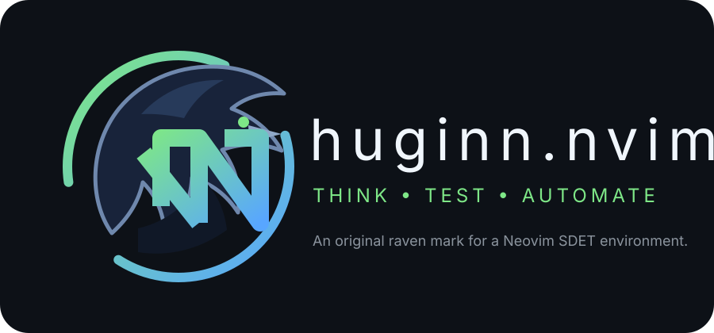

# Huginn.nvim

<p align="center">
  
</p>


**Huginn** is an opinionated Neovim environment for SDETs.

> Think. Test. Automate.

The project separates two concerns:

- **Lua** — editor, plugin and integration implementation.
- **YAML** — project-specific SDET conventions and workflows.

This keeps Huginn reusable across teams without hard-coding one company's test framework.

## Initial target stack

- Neovim 0.11+
- Python
- Poetry / uv / pipenv / direct execution
- Ruff
- ty
- pytest
- neotest
- debugpy / nvim-dap
- OpenAI-compatible AI tooling
- project-level `.sdet.yaml`

## Configuration

Huginn uses three layers, applied in this order:

1. built-in defaults;
2. project `.sdet.yaml`;
3. optional user-local `huginn.local.yaml` in Neovim's config directory.

Project configuration is for team conventions. User-local configuration is for machine- or developer-specific settings and should not be committed.

Example:

```yaml
python:
  package_manager: poetry
  formatter: ruff
  linter: ruff
  type_checker: ty

testing:
  framework: pytest
  profiles:
    default:
      - tests
    unit:
      - tests/unit
    integration:
      - tests/integration

ai:
  enabled: true
  provider: corporate
  model: company-model
  instructions: []
  providers:
    corporate:
      type: openai_compatible
      endpoint: https://ai.example.test/v1
      model: company-model
      auth:
        type: oidc
        issuer: https://login.example.test
        client_id: huginn
  usage:
    # Optional session budget and blended price per 1M tokens.
    budget_tokens: 0
    cost_per_million_tokens: 0
```

The schema is available at `config/schema.json` and is associated with `.sdet.yaml` through yaml-language-server.

Configuration files are validated before they are merged. Unknown keys and invalid value types are rejected with an error notification; the invalid layer is ignored rather than partially applied.

## Testing

Pytest execution is configurable and is built from three independent pieces:

- `python.package_manager` controls the environment prefix;
- `testing.framework` selects the test framework adapter;
- `testing.frameworks.<name>.runner` provides framework-specific command inputs;
- `testing.profiles` provides reusable argument lists.

Supported package-manager shortcuts are `poetry`, `uv`, `pipenv`, and `none`. Any other non-empty value is treated as an executable prefix.

The built-in `pytest` adapter preserves the existing command model and declares its Neotest/debug dependencies. Framework adapters are registered in Lua and expose a small command-building interface, so a project-specific framework can be integrated without adding company-specific assumptions to Huginn's core. An adapter may also declare its Neotest integration and optional debug capability. Frameworks without Neotest or debug support remain usable through the command layer without a Python-specific fallback.

Keymaps:

- `<leader>tt` — run the default profile
- `<leader>tf` — run the current file
- `<leader>tp` — choose a configured profile
- `<leader>ta` — run tests with arbitrary arguments
- `<leader>tr` — run the nearest test through neotest
- `<leader>td` — debug the nearest test

The command-generation layer is isolated in `lua/huginn/testing.lua`, while `lua/huginn/framework/` owns framework adapter registration, command integration, and optional Neotest integration. Huginn's Neotest setup no longer selects `neotest-python` directly.

## AI

AI integration is provider-oriented. Huginn supports the built-in `openai` provider and custom `openai_compatible` providers. Custom providers currently use OIDC Authorization Code + PKCE for desktop authentication.

Set `ai.enabled: false` to disable CodeCompanion, AI keymaps and Huginn AI commands entirely.

The built-in `openai` provider does not require an entry in `ai.providers`. For a custom provider, the selected name must exist in `ai.providers`, use `type: openai_compatible`, and define OIDC authentication. Example:

```yaml
ai:
  enabled: true
  provider: corporate
  providers:
    corporate:
      type: openai_compatible
      endpoint: https://ai.example.test/v1
      model: company-model
      auth:
        type: oidc
        issuer: https://login.example.test
        client_id: huginn
```

Run `:HuginnAIAuth` to open the configured login page. Huginn starts a temporary `127.0.0.1` callback, receives the authorization code, exchanges it for tokens, and stores the credential outside the repository.

Usage is intentionally lightweight: CodeCompanion-reported token usage is counted for the current Neovim session. If the provider does not report usage, Huginn falls back to CodeCompanion's estimate. Set `ai.usage.budget_tokens` and `ai.usage.cost_per_million_tokens` to see remaining session budget and an estimated cost.

- `:HuginnAIUsage` — show requests, tokens, estimated cost and remaining configured budget.

Authentication commands:

- `:HuginnAIAuth` — authenticate the configured provider in a browser
- `:HuginnAIStatus` — show authentication status
- `:HuginnAILogout` — remove the locally stored credential

The credential is stored under Neovim's data directory with restrictive file permissions. Access and refresh tokens are never stored in `.sdet.yaml`. Newly issued credentials track their access-token expiry; an expired credential is treated as unauthenticated and must be refreshed by running `:HuginnAIAuth` again.

The OIDC client must be registered as a public desktop client and allow the loopback `127.0.0.1` redirect URI. Huginn uses PKCE with the S256 challenge method.

Huginn does not require a corporate CLI for this flow.

## Design principles

- No legacy compatibility layer.
- No company-specific assumptions in the core.
- YAML describes **how the team works**; Lua describes **how Huginn works**.
- pytest remains extensible instead of being wrapped into a proprietary runner.
- AI is an assistant, not a hidden part of the test execution path.
- Security-sensitive values stay outside repository configuration.

## Repository layout

```text
lua/huginn/
├── config.lua     # configuration loading and validation
├── ai/            # AI provider authentication and integration
├── framework/     # test framework registry and built-in adapters
├── testing.lua    # test command generation
├── keymaps.lua    # editor actions
├── lazy.lua       # plugin declarations and integration setup
└── init.lua       # entry point
```

## Installation

With lazy.nvim:

```lua
{
  "burenk0v/huginn.nvim",
  dependencies = {
    "folke/lazy.nvim",
  },
}
```

Huginn bootstraps `lazy.nvim` automatically when it is not already installed. It requires Neovim 0.11+.

For a project, copy the bundled `config/default.yaml` to `.sdet.yaml` and adapt it to the project's test workflow. Keep machine-specific settings in the user-local `huginn.local.yaml`.

## Project status

Huginn has completed its stabilization phase and is being prepared for its first release. The current baseline focuses on predictable configuration, framework boundaries, AI authentication, credential handling, and failure-safe plugin integrations.

The release target is **v0.1.0**. No new feature work is planned as part of this release preparation.


Huginn is currently in a stabilization phase. Changes are focused on correctness, error handling, security-sensitive boundaries, and keeping the existing integration surface predictable.

## License

Apache-2.0.
